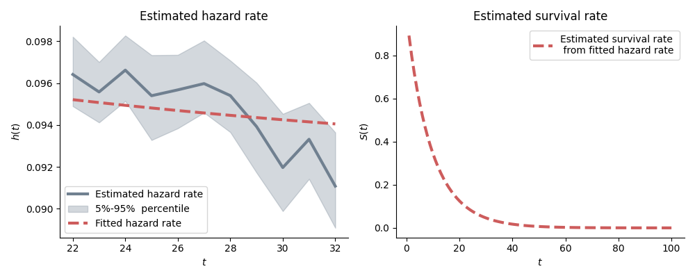
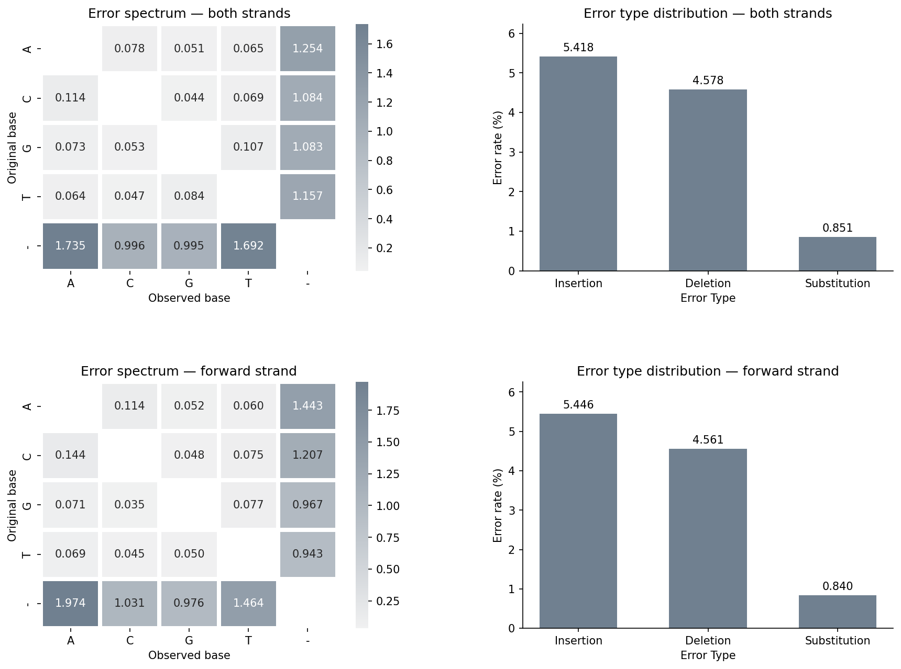
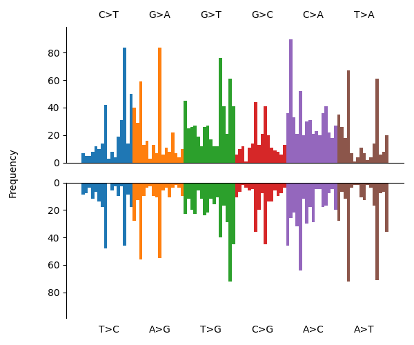
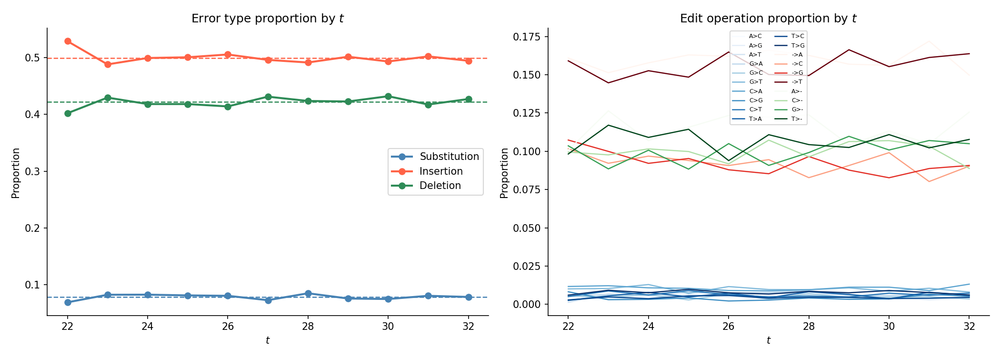
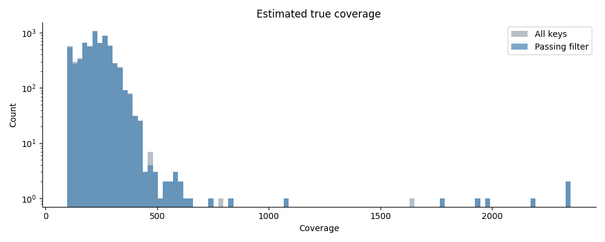
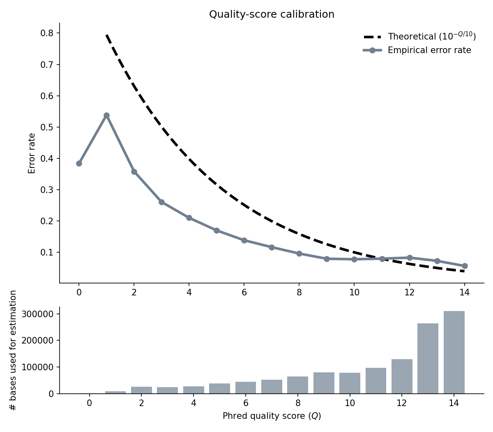

<p align="center">
  
</p>

# Skiver: Rapid quality control of genome sequencing datasets using (*k*, *v*)-mer sketches

> [!WARNING]  
> This tool is under development and testing, not production-ready yet.

Skiver is a tool that aims to perform quality control for a set of reads, estimating the sequencing error rates/types, without relying on the quality scores or the need for a reference genome. It works the best for metagenomic samples where at least one genome has high coverage (>20 $\times$).

## Installation

### Download executable

Simply download the executable from the latest release, via the following

```bash
wget https://github.com/GZHoffie/skiver/releases/download/v0.2.0/skiver
chmod +x ./skiver
./skiver
```

### Build from source

Alternatively, build skiver from the source code. Install [rust](https://rust-lang.org/tools/install/), and build using

```bash
git clone https://github.com/GZHoffie/skiver.git
cd skiver

# If default rust install directory is ~/.cargo
cargo install --path . --root ~/.cargo
```

## Quick start

Basic commands:

```bash
# sketch the read files + analyze
skiver sketch [sequence_file_1] [sequence_file_2] ... -o sequences.kvmer
skiver analyze sequences.kvmer -o output_prefix

# Alternatively, analyze the files directly
skiver analyze [sequence_file_1] [sequence_file_2] ... -o output_prefix

# If a reference genome is provided
skiver analyze [sequence_file_1] [sequence_file_2] ... -r [reference_file] -o output_prefix
```

The input sequence files can be represented using regex. Gzipped files are also accepted.

For the full set of available options, use the help function,


```bash
skiver sketch -h
skiver analyze -h
```

### Interpreting the results

See [this guide](./result_interpretation.md) for a detailed documentation of what each output file contains.

## Example

We provide scripts in `./scripts` for easy visualization of skiver's output. Below is an example of analysis using [*B. Subtilis* isolate reads from Loman Lab](https://lomanlab.github.io/mockcommunity/).

```bash
# Download the reads with SRA toolkit. If not installed, install with
# `conda install -c bioconda sra-tools`
# This read set takes ~3GB space, ~10 min to download
prefetch SRR7498042
fasterq-dump SRR7498042 # In some versions, need to run `fastq-dump SRR7498042` instead

# Create the (k,v)-mer sketch of the data in the example/ folder
mkdir -p example
skiver sketch SRR7498042.fastq -o example/SRR7498042.kvmer

# Run skiver analyze, with all the verbose output
skiver analyze example/SRR7498042.kvmer -o example/SRR7498042

# visualize the output in the figures/ folder
mkdir -p figures
python scripts/plot_all.py example/SRR7498042 -o figures/SRR7498042
```

This creates the verbose output in [`example/SRR7498042.*.csv`](example/), and visualize the output in [`figures/SRR7498042_*.png`](figures/).

Apart from `plot_all.py`, you can also use the individual scripts and adjust the parameters like the following.

- **Visualizing hazard rate and survival rate estimates**

  ```bash
  python scripts/plot_hazard_survival_rate.py example/SRR7498042.hazard_rate.csv example/SRR7498042.summary_error_rate.csv figures/SRR7498042_hazard_survival.png -t 1 -T 100 > survival_rate_estimates.csv
  ```

  This command outputs the plot `hazard_survival_rate.png`, along with the estimated survival rates in `survival_rate_estimates.csv`, with the range of `t` specified using `-t` and `-T`.

  <p align="center">
    
  </p>

- **Visualizing error spectrum**

  ```bash
  python scripts/plot_spectrum.py example/SRR7498042.summary_error_spectrum.csv figures/SRR7498042_spectrum.png --normalize
  ```

  will plot the error spectrum in `figures/spectrum.png`. If `--normalize` is set, the error spectrum is normalized such that the frequencies sum to 1. Otherwise, they sum up to the estimated per-base error rate. The output image looks like this.

  
  <p align="center">
    
  </p>

  On the top subplots, the error rates are calculated by accounting for both the forward and reverse complement of the reads. On the bottom, only the forward strand is included.

- **Visualizing single base substitution (SBS) spectrum**

  ```bash
  python scripts/plot_sbs96_spectrum.py example/SRR7498042.summary_error_spectrum.csv figures/SRR7498042_sbs96_spectrum.png
  ```

  will plot the [SBS96](https://cancer.sanger.ac.uk/signatures/sbs/sbs96/) spectrum.

  <p align="center">
    
  </p>

- **Visualizing single base substitution (SBS) spectrum**

  ```bash
  python scripts/plot_error_spectrum_dependence_on_t.py example/SRR7498042.summary_error_spectrum_dependence_on_v.csv figures/SRR7498042_error_spectrum_dep_t.png
  ```

  will plot how the composition of error rate change with *t*. If our assumption is valid, the composition should not vary too much across *t*.

  <p align="center">
    
  </p>

- **Visualizing coverage** (beta)

  ```bash
  python scripts/plot_coverage.py example/SRR7498042.kvmer.csv example/SRR7498042.summary_error_rate.csv figures/SRR7498042_coverage.png
  ```

  will plot the estimated **true** coverage of the analyzed file. The true coverage is estimated by the multiplicities of the key from the sketched (k,v)-mers, divided by $\hat{S}(k)$.

  <p align="center">
    
  </p> 

- **Quality score calibration** (beta)

  ```bash
  python ./scripts/plot_qscore_calibration.py example/SRR7498042.summary_phred.csv figures/SRR7498042_qscore_calibration.png
  ```

  will plot the theoretical and empirical error rates of the Phred scores in log scale (if included the `--log` option), along with a histogram of the Phred scores.

   <p align="center">
    
  </p> 


## Contribution

This is my first project in rust and this project is in early stages of development. All contributions, suggestions, and feature requests are welcomed!

## Citation

Gu, Z., Sharma, P., Wong, L., & Nagarajan, N. (2026). [Skiver: Alignment-free Estimation of Sequencing Error Rates and Spectra using (*k*, *v*)-mer Sketches](https://www.biorxiv.org/content/10.64898/2026.02.12.705514v1). *bioRxiv*, 2026-02.
